# 99 Bottles of OOP

# 1

## 1.1

### 1.1.1

**Terminology**

- We "send a message" to an object to invoke behavior
  - "Sending a message to a method" is often used interchangeably with "calling a method"
    - This "send" vs "call" implies different things
    - "Calling" suggests what that code does
- Code clarity is built on good names
- Asking these questions will give you insight into the cost of a piece of code
  - *How difficult was it to write?*
  - *How hard is it to understand?*
  - *How expensive will it be to change?*

- **You should name methods not after what they do, but after what they mean, what they represent in the context of your domain**
  - In our example, "Beer is the thing that you drink" or "Beer is the beverage" in context of the 99 bottles of beer on the wall song
  - `Beer` is the `Beverage` used in the song
    - `Beverage` is one level of abstraction higher than `Beer`
  - Name methods after the concept they represent rather than how they currently behave

<br>

## 1.2 Judging Code

- Multiple solutions to multiple problems
  - Specifically, there were multiple solutions shown for the 99 bottles problem
- How do we know what solution is best?

### 1.2.1 Evaluating Code on Opinion

- Everyone has an opinion on what good code looks like
- Many definitions that generally describe how code looks when it's done w/o providing any concrete guidance about how to get there

### 1.2.2 Evaluating Code Based on Facts

- A "metric" is a measure of some quality of code
- If you apply the same metric to two different pieces of source code, you can then compare that code (at least in terms of what the metric measures) by comparing the resulting numbers
- 3 different metrics looked at here
  - Source lines of code
  - Cyclomatic Complexity
  - ABC

#### Source Lines of Code

- Used to be used to predict the total effort needed to develop software, to measure productivity of those who write it,a nd to predict the cost of maintaining it
- Lots of flaws
- Prediction done by counting the SLOC of *existing* projects for which total effort is known, deciding *which* of those existing projects the new project most resembles, and then running a cost estimation model to make the prediction
- However, measuring programmer productivity by counting lines of code assumes that all programmers write equally efficient code
- SLOC numbers reflect code volume, so knowing SLOC alone is not enough to predict code quality

#### Cyclomatic Complexity

- A "mathematical technique" to identify code that is "difficult to test or maintain"
- Counts number of unique execution paths through a body of source code
- A method with many deeply nested conditionals would score very high (bad)
- A method with no conditionals at all would score 0 (good)
- Metric is meant to identify code that is *difficult to test or maintain*
- Can be used in a few different ways
  - Can be used to compare code
    - Two variants of same method - you can choose the one with lower cyclomatic complexity
  - Can limit overall complexity by setting a standard for how high it can be
  - You can use it to determine if you've written enough tests
    - Cyclomatic complexity tells you the minimum number of tests needed to cover all logic in the code
- This metric is useful but views code through narrow lens
  - Code does more than just evaluate conditions
    - It also assigns values to variables and sends messages
      - As you do more and more of each, your code becomes increasingly difficult to understand

#### Assignments, Branches, and Conditions (ABC) Metric

- *Assignments* is a count of variable assignments
- *Branches* counts not branches of an if statement but branches of control
  - Function calls or message sends
- *Conditions* counts conditional logic
- High ABC numbers indicate code that takes up a lot of mental space
  - ABC is a measure of complexity
    - Highly complex code is difficult to understand and change, so ABC scores are a proxy for code quality
- High scores suggest that code will be hard to test and expensive to maintain

### 1.2.3 Comparing Solutions

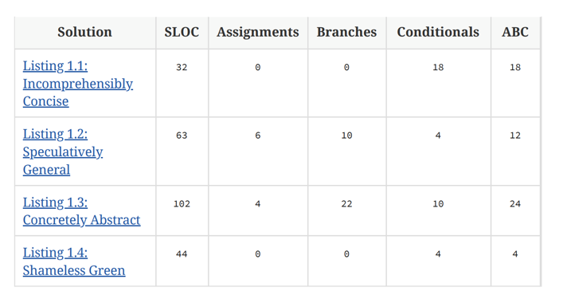

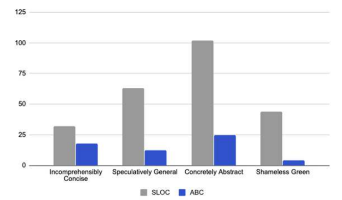

# 2 Test Driving Shameless Green

## 2.1 Understanding Testing

- Practice of writing tests before writing code is known as *test-driven development*
  1. *Write a test*
     1. Because the code does not yet exist, this test fails
  2. *Make it run*
     1. Write the code to make the test pass
  3. *Make it right*
     1. Each time you return to green, you can refactor any code into better shape, confident that it remains correct if the tests continue to pass
- This cycle is often called *Red/Green/Refactor* - the "TDD mantra"
- Must repeatedly decide which test to write next, how to arrange code so that the test passes, and how much refactoring to do once it does
- *Quick green excuses all sins*
- *Shameless Green* generally strives for maximum understandability but it is generally unconcerned with changeability

## 2.2 Writing the First Test

- First test is often most difficult
  - Know the least amount about whatever it is you intend to do
- Feels important to choose the "right" first test
- In reality, first test hardly matters
  - Ideas may turn out to be right, or they may turn out to be wrong
- You can't figure out what's right until you write some tests
  - *It is very possible that you may realize that the best course of action is to throw everything away and start over*
- The purpose of your tests might very well be to prove they represent bad ideas
  - Learning which ideas won't *is* forward progress, though it may seem disappointing in the moment

<br>

- Think about what your API might look like
  - Our example being "99 Bottles"
- Might look like:
  - `verse(n)` - return the lyrics for the verse number `n`
  - `verses(a, b)` - return the lyrics for verses numbered `a` through `b`
  - `song()` - return lyrics for the entire song
- API allows others to request a single verse, range of verses, or the entire song
- Once you have the API, there are a number of possibilities for the first test
  - In our case, it makes logical sense to start with a test for `verse(n)` because it seems like the other methods will build on top of it

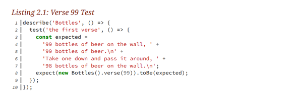

- This test is very simple but highlights a few decisions to be made
  - There is to be a class `Bottles`
  - There is to be a method `verse(n)` defined by `Bottles`
- 3 parts to test
  - *Setup* - create the specific environment for the test
  - *Do* - perform the action to be tested
  - *Verify* - confirm the result is as expected
  - Note this is the same as *given/when/then* format

<br>

- When doing TDD, you toggle between wearing two hats
  - While in the "writing tests" hat, you keep your eye on the big picture and work your way forward with the overall plan in mind
  - When in the "writing code" hat, you pretend to know nothing other than the requirements specified by the test at hand
    - This makes each individual test correct, but until all tests are written, the code is incomplete

## 2.3 Removing Duplication

- Once first test passes, next test should do the simplest, most useful thing that proves your existing code to be *incorrect*
- TDD requires you pass tests by writing simple code
- There are many solutions to passing the test added here

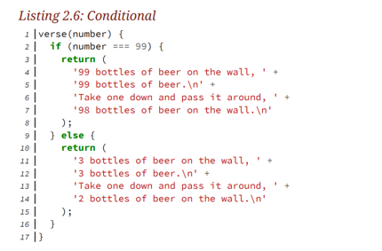

- This code technically works for verse 99 and 3, and does the absolute minimum needed to pass the tests
- However, this code introduces a cycle (see discussion on *Cyclomatic Complexity*) b/c there is a new execution path through the code
- This code is simple in the sense that it can't do much, but it does the small thing in an overly complex way

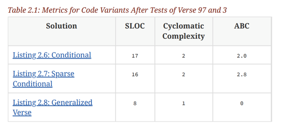

## 2.4 Tolerating Duplication

- Now we need to add a test for verse 2, where the last line of the verse changes from `bottles` -> `bottle`
- Opinion is here is that the `Stark Conditional` code is better than `Conditional with Embedded Logic` because it resists creating an abstraction in advance of all information
- Important questions to ask when introducing an abstraction
  - *Does the change I'm contemplating make the code harder to understand?*
  - *What is the future cost of doing nothing now?*
  - *When will the future arrive, or how soon will I get more information?*
- Shameless Green means optimizing for understandability, not changeability, and patiently tolerating duplication if doing so will help reveal the underlying abstraction

## 2.5 Hewing to the Plan

- Sometimes makes sense to eliminate duplication and other times to retain it
- Goal is to use green tests to maximize the understanding of your problem and to unearth all the available information before committing to abstractions
- Shameless Green is optimized to be straightforward and intention-revealing
  - Doesn't concern itself with changeability or future maintenance

<br>

- At some point you will write a full test suite for "99 Bottles", and a complete Shameless Green solution
  - Once this is done you can:
    - Walk away
    - Refactor it into a more changeable arrangement by DRYing out duplication and extraction abstractions
  - Within Shameless Green, it is acceptable to create abstractions of ideas for which you have many unambiguous examples
    - For example, verses 3 to 99 are the same for "99 bottles"

<br>

- Now add a test for verse 1
- Notice that the implementation switches from using `if` statement to `switch` statement
  - Use of `if/else` usually implies that each condition varies in a meaningful way
  - Use of `switch` implies that every condition checks for equality against an explicit value

<br>

- Now add a test for verse 0
- Add another case to the switch statement
- Code completes the `verse` method
- Implementation reveals some important concepts in the domain
  - It's easy to see that there are 4 basic verse variants
    - verse 0
    - verse 1
    - verse 2
    - verses 3-99
- `switch` statement reveals that 0, 1, and 2 are special cases
  - You have to still read carefully to see what does differences are

<br>

- This code is easy to understand because there aren't many levels of indirection
- We produced every king of verse before diverging onto tangents to DRY out small bits of code that the verses have in common
- Goal is to quickly maximize the number of whole examples before extracting abstractions from their parts

## 2.6 Exposing Responsibilities

- Now that we have a verse method, we want to go to our next more complicated piece of the api `verses(a, b)`
- Example of most basic test and implementation
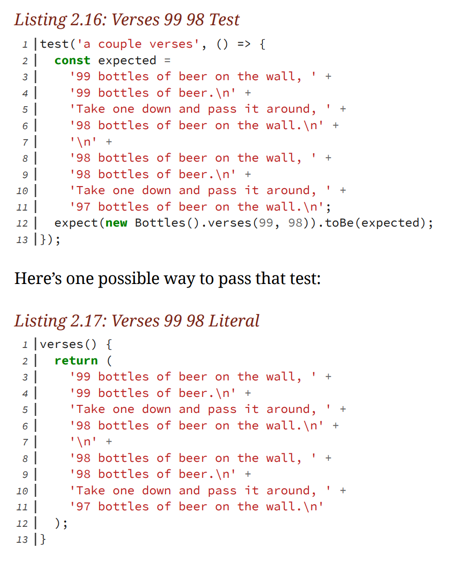

<br>

- Some duplication is tolerable during the search for Shameless Green
- Not all duplication is helpful, and there's something in the duplication above in the source code that isn't tolerable
- Duplication is useful when it supplies independent, specific examples of a general concept that you don't yet understand
  - For example, the `switch` statement we're using within verse has 4 templates
- The problem with what has been done above is it does *not* give a new independent example
  - Verses 99/98 already are handled by the switch statement
  - The code we have in `verses(a, b)` is just the nongeneralized code in the default switch case
- *This code duplicates an example that already exists and so supplies no new information about the problem*
- Refactored solution

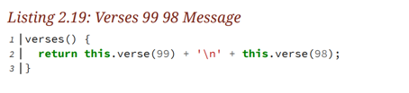

- We can see here now that `verses` are made up of individual `verse`s
  - Remember we are doing the simplest thing possible here

<br>

- 3 different ways to make tests pass
  - **Fake It ("Till You Make It")**
  - **Obvious Implementation**
  - **Triangulate**
- The current implementation of `verses` is an example of `Fake It` because the tests are not complete
- An *Obvious Implementation* here would be to loop from 99 down to 0, invoking `verse` for each number and concatenating the results
  - *When the obvious implementation is evident, it makes sense to jump straight to it*
    - Getting this wrong though is worse than taking the smaller incremental steps done using *Fake It*
- *Fake It* style is recommended
  - Forces you to write just enough code to pass the tests which forces you to write better tests
- *Triangulate* requires writing several tests at once, which means you'll have simultaneous broken tests
  - Idea is to write one bit of code which makes all the tests pass
    - This is meant to force you to converge upon the correct abstraction in your code
  - 

<br>

- Shameless Green expands Triangulation
  - You can expose a common, underlying abstraction through the accumulation of multiple concrete examples
  - *These concrete examples often contain some duplication, but this duplication is fine as long as each overall example is independent and unique*

## 2.7 Choosing Names

- Going back to the API, last remaining method we have is `song()` which prints entire song of 99 bottles
- Reasonable question here is do we need it?
  - The user could send `verses(99, 0)`
  - Think about this from the senders point of view:
    - Sender has to KNOW that there are 99 verses in the song, maybe they don't know that
    - Maybe `song()` uses `verses(99, 0)` under the hood, but the sender doesn't care about that
- If you are *sending* a message, you want to incur a limited number of dependencies
- If you are *method provider*, then your obligation is to inflict few dependencies
  - The `send()` method inflicts only 1, you need to know its name

## 2.8 Revealing Intentions

...

## 2.9 Writing Cost-Effective Tests

...

## 3 Unearthing Concepts

## 3.1 Listening to Change

- Coding is expensive
  - Writing it costs time or money (or both)
- If you've solved a problem (like we have here for 99 bottles), and you choose to refactor now rather than later, you pay the opportunity cost which is not being able to work on *other* problems
- So how do you know if you're using your time wisely?
  - You should wait for the arrival of new requirements
    - Tells you two things:
      - Specifically, how should code change
        - This avoids us having to guess how it will change
        - This requirement will tell us exactly how we should have initially arranged the code
      - Generally, the need for change imposes higher standards on the affected code
        - Code that never changes doesn't need to be changeable, but once a new requirement arrives, things change
          - Code that needs to be changed must be changeable

<br>

- New requirement:
  - Users have requested that you alter the 99 Bottles code to output "1 six-pack" in each place where it currently says "6 bottles"
  - Knowledge of domain may prompt you to ask other stakeholders
- Because of the new requirement, we have the opportunity to refactor our existing implementation to support making this change

<br>

- What if you had to add more conditionals to the current implementation?
  - We have to expand the cases in our switch statement
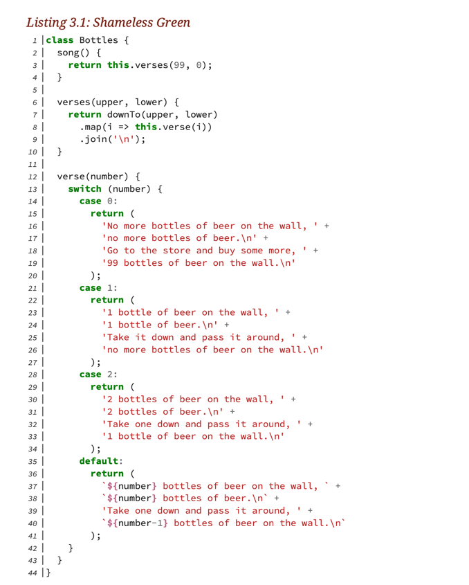

## 3.2 Starting with the Open/Closed Principle

- *Decision to refactor in the first place should be determined by whether your code is already "open" to the new requirement*
- The *Open/Closed* principle means that code is open to a new requirement when you can meet that new requirement without changing existing code
- This principle says that you should not conflate the process of moving code around (refactoring) with the act of adding new features
  - These should be two separate operations
  - First, rearrange the existing code such that it's open to the new feature
  - Second, add the new code

<br>

- The current `Bottles` class is not open to the new requirement b/c adding new verse variants requires editing the conditional
- We first need to refactor the existing code into a shape so we can implement the new requirement *by only adding code*
- What if we don't know where to start? Use flowchart below

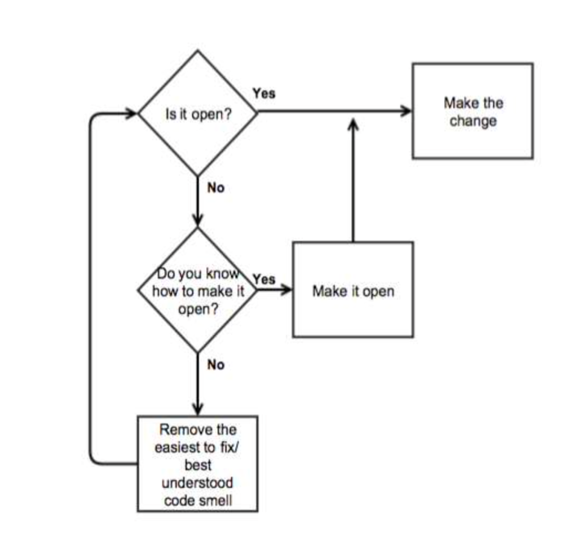

## 3.3 Recognizing Code Smells

- Trick to improving code that contains many flaws is to isolate and correct them one at a time - *refactoring*

## 3.4 Identifying the Best Point of Attack

- The 99 bottles code is not open to the six-pack requirement b/c we would have to go add additional cases to the switch statement
  - *Switch Statements* code smell
- There is also a lot of duplicates code in this Switch Statement - *Duplicated Code*
- *Duplicated Code* is an easier code smell to tackle
- Important to note here that there is no *direct* link between removing the duplication, and succeeding in making the code open to the six-pack requirement
  - Plan is to remove code smells one at a time, and the code should become "open" to this change during this process

## 3.5 Refactoring Systematically

- *Refactoring is the process of changing a software system in such a way that it does not alter the behavior of the code yet improves internal structure*
- Reminder of how we're going to implement this new feature
  1. Rearrange existing code so that it becomes open to the new requirement
     1. Done via refactoring
  2. Write new code to meet that requirement
- Safe refactoring relies on tests
- **Tests that make assertions about *how* things are done, rather than *what* actually happens, will cause tests to break simply by rearranging code**
  - For example, a test that makes assertions about how a method is implemented will obviously break if you change the method's implementation, even if its output is unchanged
- In this situation, you will need to fix the tests before continuing

## 3.6 Following the Flocking Rules

- Switch statement contains 4 branches, each of which contains a verse template
- The templates represent distinct verse variants
  - The variants are different but are alike in some abstract way
- Each variant is a verse in the song - in that sense they are all the same
- Under each concrete variant is a generalized verse abstraction
- If we can find that abstraction, you could use it to reduce the 4 branch switch statement to a single line of code

**Flocking rules**
1. Select the things that are most alike
2. Find the smallest difference between them
3. Make the simplest change that will remove the duplication

- Changes to code can be subdivided into 4 distinct steps
  1. Parse the new code
     1. Confirming syntax is valid
  2. Parse and execute it
     1. Proving code runs w/o blowing up
  3. Parse, execute, and use its result
     1. Ensure code returns the correct result
  4. Delete unused code

- As you're following the flocking rules
  - For now, change only one line at a time
  - Run the tests after every change
  - If the tests fail, undo, and make a better change

## 3.7 Converging on Abstractions

### 3.7.1 Focusing on Difference

- When examining a piece of code that has some duplication in it, focus on differences
  - We want to focus on encapsulating the concept that varies
- If two concrete examples represent the same abstract, and they contain a difference, the difference must represent a smaller abstraction within the larger one
  - If you can name the difference, you've identified the smaller abstraction
- Following small refactoring steps, the abstraction will become known to us - we don't have to know the abstraction in advance
- To reduce the switch statement to a single line of code, first identify the things that are most alike
- If you look at `case 2` and `default`, instead of hardcoding 1 or 2, we could do say `number - 1` and `number`, respectively (same as default case)
  - The only remaining difference then would be `bottle` vs `bottles`

### 3.7.2 Simplifying Hard Problems

- Want to completely combine default case and case 2 before looking at other cases

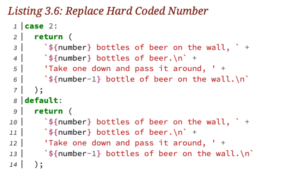

- Now only remaining difference is `bottle/bottles` on the last line

### 3.7.3 Naming Concepts

- Small difference between verse 2 and verses 3-99 must represent a smaller abstraction within that larger one
- Need to decide what the words "bottle" and "bottles" mean in the **context** of the song
- Two pieces of information that can help in the struggle for a name
  - One is a general rule
  - Other is the new requirement

<br>

- New requirement was the need to say "six-pack" instead of "bottle/bottles" when there are 6 bottles
- The string "six-pack" is one more concrete example of the underlying abstraction
- When naming a thing, it should be one level of abstraction higher than the thing itself
  - The strings "bottle/bottles/six-pack" are instances of some category, and the task is to name that category using language of the domain

<br>

- One way to identify the category is to imagine the concrete examples as rows and columns in a spreadsheet

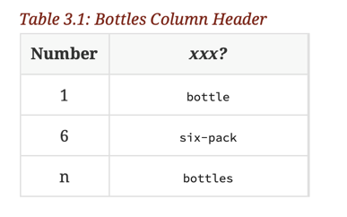

- Column 1 contains numbers, so "Number" makes sense as a column header
- When struggling to find a good name but have only a few concrete instances to guide you, it can be illuminating to imagine other things that would also be in the same category
  - Wine can come in a carafe, juice sometimes in small boxes, soft drinks in cans
- So what kind of "thing" is a bottle?
  - It's a `container` (for beer in this context)

### 3.7.4 Methodical Transformations

- Make small changes while keeping green - that way if something does go wrong, you know exactly what caused the issue
- If you ever need to quickly go to production, keeping your code green means it is working in its current state and can go at any point

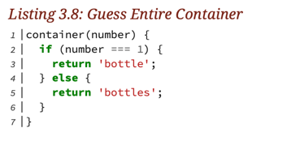

- Final container code

### 3.7.5 Refactoring Gradually

- "Gradual cutover refactoring" - a strategy for keeping the code in a releasable state by gradually switching over a small number of pieces at a time
  - This keeps code deployable
- Case 2 finally gets deleted here after creating the `container` method
- This style helps to avoid length debugging sessions

## 4. Practicing Horizontal Refactoring

### 4.1 Replacing Difference With Sameness

- Refactoring rules say to start by choosing the cases that are most alike
- Only 3 different verse templates remain
- Default and case 1 are now the most same
- Lines 1 and 2 of case 1 are easily refactored to be the same as default using what we already have

### 4.2 Equivocating About Names

- We now have the 3rd line that are still difference between case 1 and default
  - `'Take it down and pass it around, '` vs `Take one down and pass it around, '`
    - We have this `it` vs `one` concept
- The challenge here is that `it` and `one` are so generic
- Some strategies for dealing with this
  - Spend 5 to 10 minutes thinking about what the right name is
    - Choose the best name in this interval
      - If you discover later that it wasn't the best name, you can change it
      - Advantage of this is that at least you have a name that is somewhat useful
  - Be more cost-effective and instantly choose a meaningless name like `foo`
    - Move forward quickly and (hope) that the name *will* get improved later
    - *You'll never know less than you know right now*
  - Seek others for help with naming the concept
- In our case, we're going to use `pronoun` for now
  - We can now move forward this with refactoring to make line 3 the same between case 1 and default

### 4.3 Deriving Names from Responsibilities

- The `pronoun` message returns the word that is used in place of the noun `bottles`, following the word `take` in phrase 3 of each verse
- Only line 4 remains in case 1 and default
- Both phrases end in `of beer on the wall`
- Difference is `no more bottles` vs `${number - 1} ${this.container(number - 1)}`
  - Can remove `bottles` by using the `container(number)` method
- Note here, that the difference is now between a string `no more` and code `${number - 1}`
  - We can still create the same type of table though
    - As we have done before, use the table to name the concept and then we can create a method from that concept

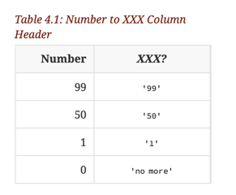

- Looking at this concept, we could name this concept the `remainder` of bottles
- However, when looking at case 0 line 1, `No more` in this case is not the `remainder` it is what we are starting with, so `remainder` probably doesn't make sense
  - If we initially named it `remainder`, that's okay, we would've gotten to case 0 and realized the concept wasn't quite right, and we would've refactored
- Thinking more generally, we could use something `quantity`


### 4.4 Choosing Meaningful Defaults

- `quantity` method is implemented here, and case 1 is deleted

### 4.5 Seeking Stable Landing Points

- We have 3 new concepts after case 1 and 2 have been deleted
  - quantity
  - pronoun
  - container
- Notice how similar the methods are
  - Each take `number`
  - Each have an if/else block
  - Each check `number` in the `if` conditional to decide what to do
- This consistency is a direct result of the refactoring rules we have followed

### 4.6 Obeying the Liskov Substitution Principle

- Only have default case and case 0 to go now
- Difference in line 1 is `No more` vs `${number}`
  - We can't use `quantity` method right off the bat, because it will return `no more`
- We utilize the `capitalize` helper that changes the first letter of a string to be capitalized

We now have this

```
  verse(number) {

    switch(number) {
      case 0:
        return (
          `${capitalize(this.quantity(number))} ${this.container(number)} of beer on the wall, `
          + `${capitalize(this.quantity(number))} ${this.container(number)} of beer.\n`
          + 'Go to the store and buy some more, '
          + '99 bottles of beer on the wall.\n'
        );
      default:
        return (
          `${number} ${this.container(number)} of beer on the wall, `
          + `${number} ${this.container(number)} of beer.\n`
          + `Take ${this.pronoun(number)} down and pass it around, `
          + `${capitalize(this.quantity(number - 1).toString())} ${this.container(number - 1)} of beer on the wall.\n`
        );
    }
  }
```

- Note here that the `quantity` method returns a number if the parameter based to the method is not 0
- This causes an issue when using the `capitalize` helper in the default statement
- Because of LSP, `quantity` should be consistent with its return type, so that verse does not need to handle the result in different ways

<br>

- The idea of reducing dependencies imposed upon message senders by requiring the receivers return trustworthy objects is a generalization of the Liskov Substitution Rule
- Liskov requires that objects be what they promise they are
  - When using inheritance, you must be able to freely substitute an instance of a subclass for an instance of its superclass
    - Subclasses are their superclasses *plus more*, so this should always work
- This rule also applies to duck types
- When relying on duck types, every object that asserts it plays the duck's role must completely implement the duck's API

<br>

- This rule prohibits you from doing anything that would force the sender of the message to test the returned result in order to know how to behave
- Receivers have a contract with senders, and it must be fulfilled

<br>

- Violations force message senders to have knowledge of various return types, and to either treat them differently, or convert them into something consistent
- The `quantity` method in its original implementation returned either a string or a number

### 4.7 Taking Bigger Steps

- Now our difference is in line 3 of case 0 and default
  - `Go to the store and buy some more, ` vs `Take ${this.pronoun(number)} down and pass it around, `
- Only thing these two lines have in common `,`
- If case 0 and default reflect a common verse abstraction, this difference must represent a smaller concept within the that larger abstraction
- It doesn't matter how different they are
  - *Their presence here with their differences mean they reflect a single concept*
- We must name the concept, create a method to represent it, and then replace the difference with a message send

<br>

- This part of the song represents what happens as a result of the current number of beers
- If beers exist, you drink one - if not, you go shopping
- These lines describe the *action* to take, so that's a good name for this concept

### 4.8 Discovering Deeper Abstractions

- So far we have the `container`, `pronoun`, `quantity`, and `action` concepts that have been identified, and we have created methods for them
- The only remaining difference is in like 4
  - `99 bottles of beer on the wall.` vs `${this.quantity(number - 1)} ${this.container(number - 1)} of beer on the wall.`
- If we call `this.quantity(99)` instead of having the hardcoded 99, we know that `quantity()` still works in this scenario
- Now we have a difference of `99` vs `number - 1`
- Now, as before, we should name the concept and create a method, and send a message in place of the difference
- Concept is called `successor` - what number comes next in the verse based on the current number of bottles

### 4.9 Depending on Abstractions

- If you have a concept in your code behind a named method, you should use that method everywhere

# 5. Separating Responsibilities

- Remember, refactoring was done b/c of the arrival of the six-pack requirement
- Without this requirement, we may have stopped with the *Shameless Green* implementation

## 5.1 Selecting the Target Code Smell

- Code should be open for extension and closed for modification
- We've replaced a fair amount of duplication with well-named methods that expose concepts in the 99 Bottles domain
- Sometimes refactoring is something that makes things worse from a "changeability" perspective
  - Your code after being refactored is even less open to the change imposed by a new requirement
- Refactoring allows you to explore a problem domain safely

<br>

- Our code, in its current state, doesn't seem any more amenable to the change than it did before the refactoring
- However, it is improved, so we should continue forward in hopes that as we continue down the refactoring path that our code will become open to the new requirement
- *This means that we need to pick the next code smell and clean it up*

### 5.1.1 Identifying Patterns in Code

- One way to get better at identifying code smells is to practice describing the characteristics of code

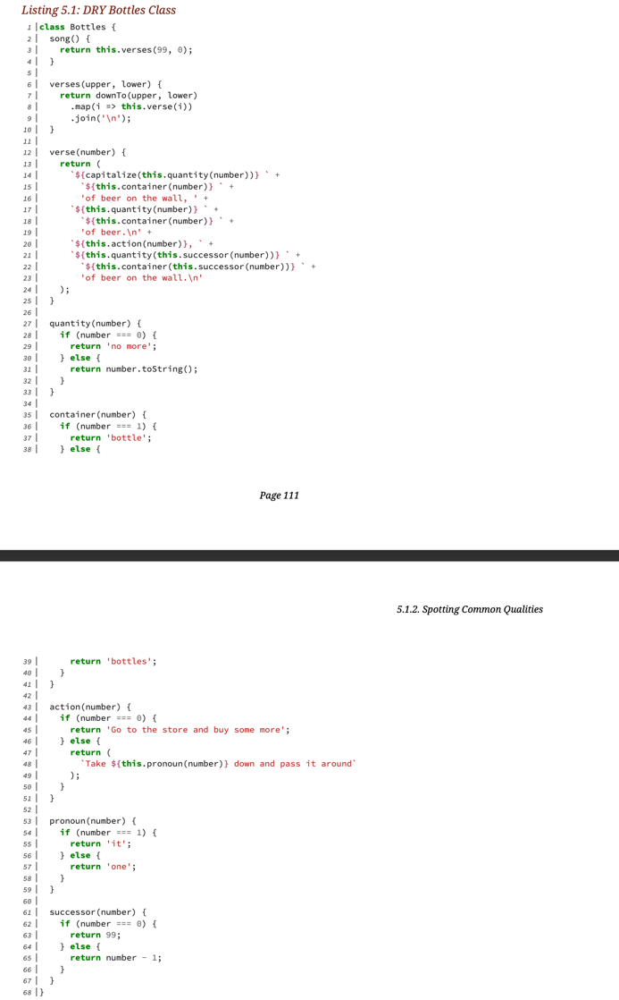

- Some questions to ask based on the current code:
  - Do any methods have the same shape?
  - Do any methods take an argument of the same name?
  - Do arguments of the same name always mean the same thing?
  - If you were going to break this class into two pieces, where's the dividing line
- For those methods created by the Flocking Rules (quantity, container, action, pronoun, and successor):
  - Do the tests in the conditionals have anything in common?
  - How many branches do the conditionals have?
  - Do the methods contain any code *other* than the conditional?
  - DOes each method depend more on the argument that got passed, or on the class as a whole?

### 5.1.2 Spotting Common Qualities

- Question 1: Do any methods have the same shape
  - Yes, the flocked five all have the same shape
  - It's not clear yet what this means though
- Question 2: Do any methods take an argument of the same name
  - Yes `verse` + flocked five all take argument of same name
- Question 3: arguments of the same name always mean the same thing?
  - Six methods take `number` as an argument - the `verse` method and flocked five
  - The `number` being used in the flocked 5 is really *bottle number*
  - The `number` being used in `verse` is really *verse number*
- Question 4: If you were going to break this class into pieces where's the dividing line
  - After `verse` and before the flocked five methods

5.1.3 Enumerating Flocked Method Commonalities

...

5.1.4 Insisting Upon Messages

- Flocked 5 methods share similar shape

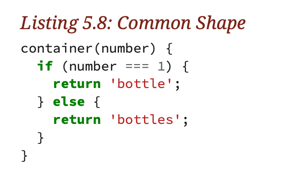

- `container` (in this example) not only has a dependency on `number` but it's also forced to understand what the specific values of `number` mean, and to know what to do in each case
  - If any of these things change, the `container` method might be forced to change in turn

<br>

- Object-oriented practitioners are wary of conditionals
- The above pattern means that objects are missing, and suggests that subsequent refactorings are needed to reveal them
- This does NOT mean tht you'll never have a conditional in OO code
- There *is* a place for conditionals in OO
- In OO, there are pools of small objects that collaborate together to accomplish tasks
- Collaborators must be brought together in useful combinations
- *Some object, somewhere, must choose which objects to create, and this often involves a conditional*
- Note: there's a big difference between a conditional that selects the correct object and one that supplies behavior
  - 1st is acceptable and generally unavoidable
  - 2nd suggests that you are missing objects in your domain
- It would be better in `container` if we could do the following

```
container(smarterNumber) {
  return smarterNumber.container();
}
```

## 5.2 Extracting Classes

- The questions talked about previously identify characteristics that group  methods together, and  many of these groups overlap
- We see an example of *Primitive Obsession* in the current code 
  - This is when you use a primitive to represent a concept in your domain
  - Cure for ths is to extract a new class to use in place of the primitive - *Extract Class*

### 5.2.1 Modeling Abstractions

- Primitive that we're replacing is the *number* that is being passed to out flocked five
  - It is NOT a *bottle*
    - A bottle is something that exists in the real world - we just have a number
- It's easy to imagine creating objects that stand in for things, but the power of OO is that it lets you model ideas
- Model-able ideas often lite dormant in interactions between other objects - pay attention to this

### 5.2.2 Naming Classes

- Methods should be named after what they *mean*
- Classes should be named after what they *are*

### 5.2.3 Extracting BottleNumber

- Not using TDD to extract class named `BottleNumber`
- We will use existing tests to ensure that `BottleNumber` is working as expected
  - The existing unit tests in `Bottles` turns into a sort of integration test that indirectly tests `BottleNumber`

## 5.3 Appreciating Immutability

- An *immutable* object is one that does not change over time
- Instead of changing an object over time, if you want to create values, you simply create a new instance of that object with the values you want
- This is what we did here
- Advantages:
  - They never change, so they're easy to understand and reason about
    - Easy to test
  - Thread safe
    - You can't break shared state if shared state doesn't change

## 5.4 Assuming *Fast Enough*

- Achieving immutability requires the creation of sometimes (sometimes many more) new objects
- Cost of immutability is mostly in the creation of new objects

<br>

- Famous saying: *"There are only two things hard in computer science: cache invalidation and naming things"*
- A *cache* is a local copy of something stored elsewhere
- When you send a message and save the result into a variable, you've created a simple cache
- If the value in your variable becomes obsolete, you must invalidate this cache, either by discarding it, or by resending the message and saving the new result

<br>

- Caching is easy, figuring out if a cache needs to be updated can be hard
- May not be worth the cost

<br>

- Costs of caching and mutation are interrelated
- If the thing you cache doesn't mutate, your local copy is good forever
- *If you cache something that changes, you must write additional code to recognize that your copy is stale, and rerun the initial operation to update the cache

<br>

- Mutation and caching complicate code - complication is often accepted as necessary and justified by the belief that it will improve performance
- Often times, this just isn't the case
- Net cost of caching can be calculated only by comparing the benefit of increases in speed to the cost of creating and *maintaining* the cache
- Best strategy is to write the simplest code possible and measure its performance once you're done
- Start with avoiding caching, use immutable objects, and treat object creation as free

## 5.5 Creating BottleNumbers

- We can create a `Bottle Number` once for every verse

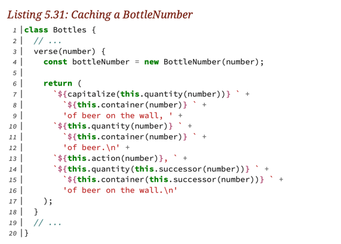

## 5.6 Recognizing Liskov Violations

- Phases 1 through 3 of the verse template refer to the same bottle number, phase 4 uses a different bottle number

# 6 Achieving Openness

- `BottleNumber` now contains methods that *isolate* the things that need to change
- The increasing isolation of concepts that need to vary is an indication tha tth ecode is moving in the right direction

## 6.1 Consolidating Data Clumps

- `BottleNumber` class contains conditionals and removing them would make the code easier to understand and cheaper to maintain
- Simpler code smell to be addressed first
- `quantity` and `container` always appear together
  - *Data clump* - situation in which (3 or more) data fields routinely occur together
- Having this means you are missing a concept
- When a clump gets sent as a set of parameters, the method that receives the clump can easily become polluted with clump management logic
- In our case `quantity` and `container` may not be a *Data Clump* but the value of removing clumps is so high that we should try and see if we should name it and group it together anyways
- Full-grown *data clumps* are usually removed by extracting a class, but in our example, makes more sense to simply create a method
- Identifying this allows our code to simply further

```
  verse(number) {

    const bottleNumber = new BottleNumber(number);
    const nextBottleNumber = new BottleNumber(bottleNumber.successor());

    return (
      capitalize(`${bottleNumber} of beer on the wall, `)
      + `${bottleNumber} of beer.\n`
      + `${bottleNumber.action()}, `
      + `${nextBottleNumber} of beer on the wall.\n`
    );
  }
```

- Note that in some places we are adding blank lines via `\n`, that we are using to signify changes in topic
  - We go from drinking the bottle of beer, to performing an action once the beer is done

### 6.2 Making Sense of Conditionals

- `BottleNumber` class is full of conditionals all of which have the same shape
- Several recipes for doing this
  - *Replace Conditional with State/Strategy*
    - Removes conditionals by dispersing their branches into new smaller objects, one of which is later selected and plugged back in at runtime
    - This results in code arrangement knows as *composition*
  - *Replace Conditional with Polymorphism*
    - Removes conditionals by creating one class to hold the defaults of the conditionals (the *false* branches) and adding subclasses for each specialization (the *true* branches of the various conditions)
    - It then chooses one of these new objects to plug back in at runtime
    - This solves the conditional problem using *inheritance*
- Both receipts result in new objects that hold logic harvested from the branches of the conditionals
- Main difference is that *Polymorphism* recipe uses *inheritance*, and the *State/Strategy* receipt does not

### 6.3 Replacing Conditionals with Polymorphism

- In OO, polymorphism refers to the idea of having many different kinds of objects that respond to the same message
- *Senders* of the message don't care which of the possible receivers they are communicating with
- Polymorphism allows senders to depend on the *message* while remaining ignorant of the type, or class, or receiver
- Senders don't care what receivers *are* - they depend on what receivers *do*

#### 6.3.1 Dismembering Conditionals

- Make a subclass (or subclasses) of `BottleNumber` that removes the need for the conditional
  - `BottleNumber0`
- Now we need a way to ensure that we're using the right kind of `BottleNumber` in `Bottles`

#### 6.3.2 Manufacturing Objects

- When several classes play a common role, some code must know how to choose the right role-playing class for any specific situation
  - This often involves a conditional
    - *This should exist only here*
- This is commonly called a *factory*

<br>

- Factory has sole responsibility for creating objects to play 
- With this change `BottleNumber` does not need the conditional anymore, but the factory WILL have the conditional (but again, this is the only place it should be)
- `BottleNumber` and `BottleNumber0` both play the *role* of bottle number
- They respond to the same messages and conform to the same API, but implement *quantity* in different ways
- We trust factory to give us the right thing, so we don't care whether we specifically have an instance of `BottleNumber` or `BottleNumber0`
- *By not being aware of the classes of the objects with which you interact, you grant others the freedom to alter your code's behavior without editing its source*
  - Someone could amend your factory to new players of the bottle number role, and your existing code would work with these objects

#### 6.3.3. Prevailing with Polymorphism

...

### 6.4 Transitioning Between Types

- The `successor` methods violate the generalized Liskov Substitution Principle
- You expect the `successor` of a bottle number to *act* like a bottle number, but it doesn't, currently we have to make the bottle number ourselves using the number returned from that value

```
const bottleNumber = this.bottleNumberFor(number);
const nextBottleNumber = this.bottleNumberFor(bottleNumber.successor());
```

- `successor` should return an instance of a `BottleNumber`, and to do that, it needs to use the factory, but currently that resides in the `Bottles` class
- So we need to:
  - Have factory located in a place where other objects can use it
  - The `successor` methods should invoke and factory
  - The `verse` method should expect `successor` to return a bottle number

# 7 Manufacturing Intelligence

- Conditional logic does not disappear entirely
- Some code, somewhere, has to know how to select the right bottle number class for any situation
  - This happens in our `BottleNumber.for` *factory*

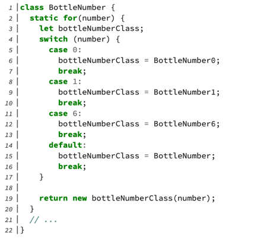

- *Factories don't know what to do: instead they know how to **chose** who does*
- They consolidate the choosing and separate the chosen

## 7.2 Fathoming Factories

- OO applications rely on polymorphism
- Polymorphism results in multiple classes that play a common role
- The power of polymorphism is that these role-playing objects are interchangeable from *the message sender's point of view*
- All players of a role share a common API
- This API exposes set of intentions that are public
- Each role-player also contains methods that implement these intentions in differing ways
- The details of these alternative implementations are invisible to the outside world

<br>

- A system comprised of message senders who collaborate with role-playing objects can be extremely tolerant of unexpected change
- For example, imagine that you create a new class that represents a new variant of bottle number
  - This bottle number is interchangeable with every other one, so any class that collaborates with an existing bottle number will be able to seamlessly collaborate with this new one
  - The message sender doesn't have to change; from its point of view this bottle number is the same as all the others
- For this to work, message senders can't know things that are unique to specific variants
- Message senders aren't allowed to know the names of the concrete variant classes, nor may they know the logic needed to choose between them
- Knowledge of the class names of the variants, and of the logic to choose the correct one can be hidden in *factories*
- Factories are where conditionals go to die

<br>

- Factories can vary along different dimensions
  - The factory can be open to new variants or closed
  - The logic that chooses a variant can be owned by the factory or by the variant
  - The factory can be responsible for knowing/figuring out which classes are eligible to be manufactured or the variants can volunteer themselves

## 7.3 Opening the Factory

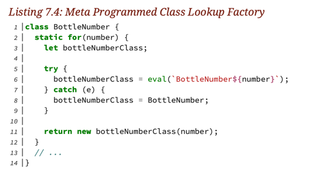

- In this example, the factory is open for extension as long as you honor the naming convention
- There are some objections to this code
  - Harder to understand
  - No explicit references to any BottleNumber0, BottleNumber1, BottleNumber6
  - Code uses an exception for flow control
  - The factory ignores bottle number classes whose names do not follow the convention
- Does the benefit justify the downsides?
  - It depends, it might if we are frequently creating new classes that play the BottleNumber role 

## 7.4 Supporting Arbitrary Class Names

- First step towards an open factory that centralizes knowledge and supports arbitrary class names is to rearrange the code to increase the isolation of the names

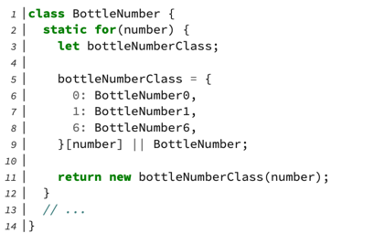

- This maps `number` to class name
- Defaults to `BottleNumber` when the number can't be found

## 7.5 Dispersing The Choosing Logic

- Having the factory own the choosing logic makes sense when it's simple and stable
- It's easy to imagine where the choosing logic is far more complicated
- The logic needed to select the right class might be long and complex
- In this scenario each chooseable object implements its own method to determine if it should be chosen 
- The factory then iterates over the possible objects and asks *them* to make the decision

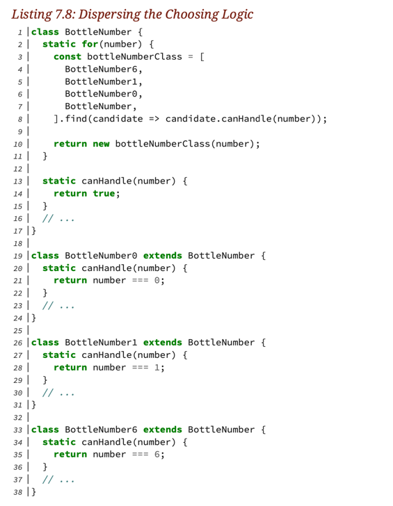

- This factory disperses the choosing logic into the things chosen
- This factory is closed, each time a new class is added you must update the list on lines 407
- `BottleNumber.canHandle` always returns `true`, so `BottleNumber` must always be the last class in the list
- It's possible that more than one `canHandle` would return `true`
  - May want to return all possible returns along with a priority so that you know which one to choose in this situation

## 7.6 Self-registering Candidates

- We currently have code that disperses the choosing logic, but the factory still has a hard-coded list of the candidate classes
- *If you would like the factory to simply continue working when new candidates appear, We have two options*
  - The factory could dynamically figure out which classes belong on its list
  - Classes who want to be on the list could explicitly as the factory to put them there
- Choice #1 above is possible only if there's something about the candidate classes that allows the factory to identify them - this may not always be true
- Choice #2 is always an option
  - If candidates are willing to depend on knowing the name of the factory, they can assume responsibility for putting themselves on the list
    - Usually this is referred to as a *registry*

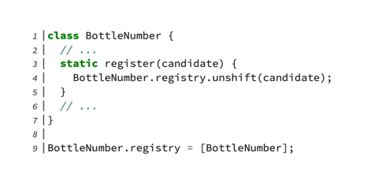

- Line 9 defines the `registry` property which is initialized to an array which contains `BottleNumber` by default
- Line 3 creates a `register(candidate)` method which adds candidate arguments to the front of the registry
- Now candidate classes can register themselves

<br>

- Our BottleNumbers all inherit currently from `BottleNumber`, but you can still create a class that plays the same role but does NOT inherit from `BottleNumber`
- Choosing between depending on a class name versus depending on inheritance means placing a bet on which dependency is more stable
  - Is it more likely that the name of the factory will change, or that role players will stop using inheritance
  - *Pay attention to how these guesses work out so that you can get better at them

# 8 Developing a Programming Aesthetic

## 8.5 Inverting Dependencies

- Dependency Inversion Principle (DIP) contributes the `D` in the SOLID acronym
  - *Depend on abstractions, not concretions*

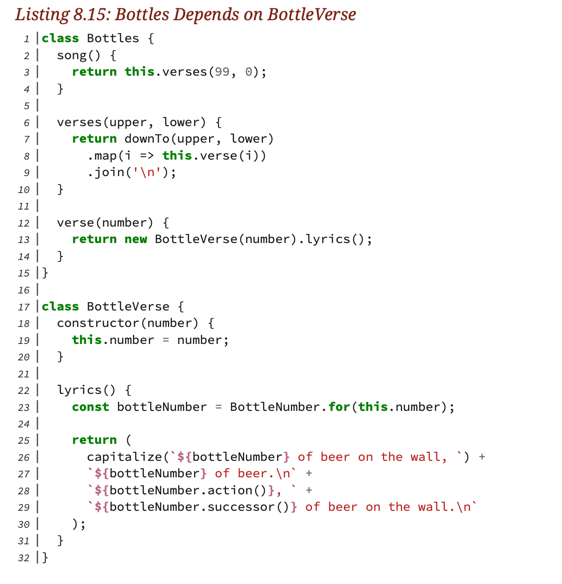

- Right now, `Bottles` can ONLY use verses that are generated via the `BottleVerse` classes
- Even if there were more classes that generated lyrics, they can't be used yet because `Bottles` is hardcoded to use only `BottleVerse`

### 8.5.1 Injecting Dependencies

- In order for `Bottles` to produce varying lyrics w/o resorting to a conditional, the code has to be rearranged so that `Bottles`can talk to *any* lyrics provider
- `Bottles` depends on, or has knowledge about, two different `BottleVerse`-related things
  - A concretion - the name of the `BottleVerse` class
  - An abstraction - the idea that there's an object that can provide a verse
- Knowing the abstraction is required
- `Bottles` has to know this so it can do its job

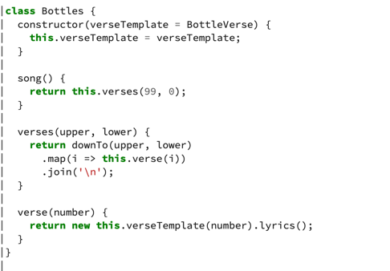

- Updated `Bottles` class that takes in `VerseTemplate` as a dependency

## 8.8 Pushing Object Creation to the Edge

- Blank line code smell?
- Applications that use dependency injection evolve into systems where object creation begins to separate from object use
- Object creation gets pushed more "towards the edges", "towards the outside"
- Objects themselves interact more towards the middle or outside

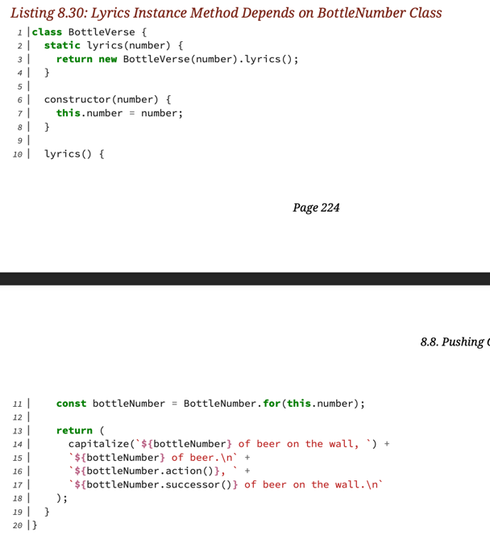

- Notice here that `static lyrics (number)` creates new `BottleVerse`
- Internally `lyrics()` method makes an instance of `BottleNumber` using the static `for` factory


# 9 Reaping the Benefits of Design

- Tests are an opportunity to explain the domain to future readers
- They expose design problems that make code hard to reuse
- Well-designed code is easy to test; when testing is hard, the code's design needs attention

## 9.1 Choosing Which Units to Test

- Every class should have its own unit test, unless doing otherwise saves money

### 9.1.1 Contrasting Unit and Integration Tests

- The original unit tests now cover everything
- They remain useful because they'll break if someone introduces an error,but they may mislead readers about the intent and workings of the present code
- `Bottles`' tests started out as unit tests but have become integration tests
- Unit tests are meant to test the public API of a single class
- The *unit under test* often requires a few collaborating objects in order to run, but these other objects only exist, so you can address the unit of interest
- Unit tests should not test collaborators

<br>

- Integration tests are intended to prove that groups of objects collaborate correctly; they show that an entire chain of behavior works
  - This is what the `Bottles` tests currently do

<br>

- General approach to testing should be to create a unit for every class, and to test every method that is in that class's public API
- In hopes that fixing the easy problems will clarify the hard ones, begin with the extremely simple `BottleNumber` subclasses
- *These classes are small and are leaf nodes on the object dependency graph which suggests that they are minimally entangled with your overall domain*
  - Leaf nodes on a dependency graph are the end of the line. Other objects depend on them, but they depend on no one. As such, they are often simpler than average, and usually represent concepts that are far from the center of your domain
  - Dependency graph: https://en.wikipedia.org/wiki/Dependency_graph

<br>

Despite the fact that `BottleNumber1` is tiny, testing it presents a conundrum

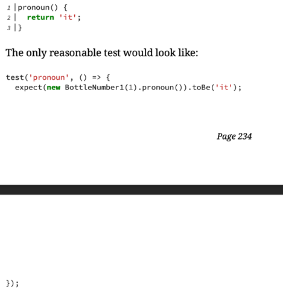

- The test assertion here exactly mirrors the method implementation
- *When the assertion duplicates the code, they both must change in lockstep or the test will fail*
- Having to change `it` in two places is a small thing, but this feels like a waste of time and money
- This doesn't add much value
- Contrary to our original intentions, maybe `pronoun` (and by extension `BottleNumber1` as a whole) shouldn't be tested at all

<br>

- Test are most valuable when they exercise confirmable behavior, and you could argue that `BottleNumber1#pronoun` has none
- This code should be exercised during testing, the most cost-effective place to do so may be within some other unit's test
- Some other test code is already covering this code when the `Bottles` tests are run
- The `Bottles` tests seem very far away from the bottles concerns

### 9.1.2 Foregoing Tests

- You should approach testing with the intent of creating unit tests for every class
- You might decide to allow one object's unit tests to cover as a collaborator as well, but this is the exception
- You should plan to write a unit test for every class, and you are entitled to expect to see a unit test for every class in someone else's code
- The `Bottles` tests provider complete coverage for all existing classes, but  they're really integration tests
- When a test involves many objects in combination, this could break far from the origin of the problem
  - This makes it hard to determine the cause of the error

<br>

- *Integration tests are great at proving the correctness of collaboration between the origin of the problem*
- They demonstrate the overall operation of all or a subset of your application
- They cover a lot of ground so they tend to be slow

<br>

- *Unit tests are for you, the programmer*
- They help you write down, communicate the expected behavior of, prevent regression in, and debug smaller units of code
- When something goes wrong, it's the unit tests that provide an error message near the offending line of code
- They run very fast

<br>

- The test previously imagined for `BottleNumber#pronoun` is so tightly bound to implementation details that they may actually *interfere* with change
- Tests should give you the freedom to improve code, not glue you to its current implementation

----------------

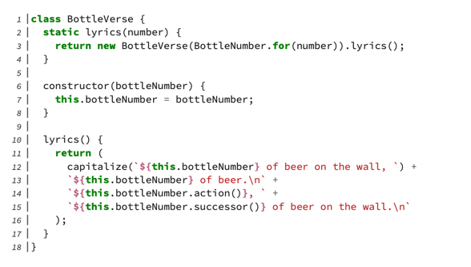

- Entire public API of `BottleVerse` consists of static `lyrics` method
- `BottleVerse` depends completely on `BottleNumber`
- From `BottleVerses`'s point of view, it is inseparable from its bottle numbers
- From `BottleNumber`s perspective, they are *independent* of context
  - They don't know they're being used by `BottleVerse`
- The bottle number classes are so small and could be completely exercised by the `BottleVerse` tests

<br>

- `BottleVerse` supplies itself with `BottleNumbers`
- `BottleNumbers` do not get created and injected from the outside
- The dependency between `BottleVerse` and `BottleNumber` is not visible to outside observers
- This wrapping of `BottleNumber` by `BottleVerse` means that if you stand in the space between the public objects of this app, you'll never see a reference to `Bottlenumber`
- `BottleNumber`s are:
  - Invisible from outside of `BottleVerse`
  - Used in no context other than `BottleVerse`
- With all of these factors, should think about bottle numbers as integral part of `BottleVerse` and test then within `BottleVerse`'s unit test

<br>

- Factory for creating `BottleNumber`s should be tested

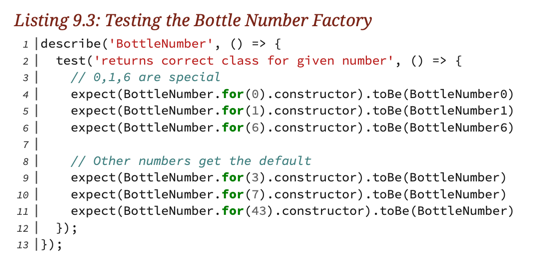

- Normally 1 assertion per test

## 9.3 Purifying Tests with Fakes

### 9.3.2 Purifying Tests With Fakes

- *Domain behavior should be on **instances** of classes* not in anything static